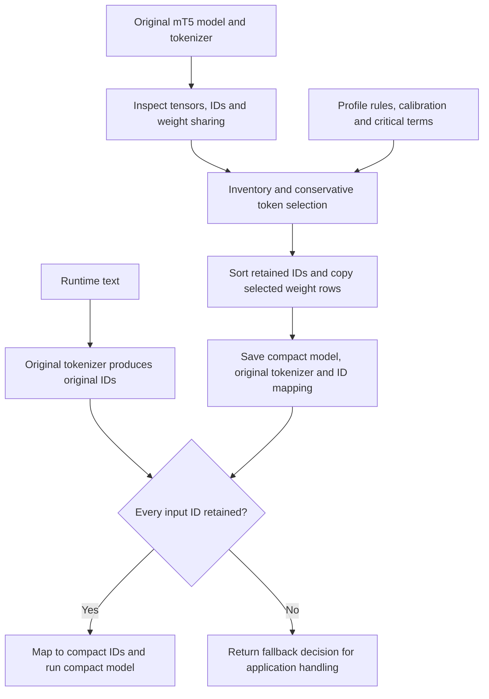

# VocabCraft

Safe, profile-aware vocabulary compaction for multilingual models.

VocabCraft reduces the vocabulary-dependent part of a pretrained model by
retaining selected embedding/output rows and assigning them contiguous IDs.
The transformer layers and the original tokenizer are preserved. Compaction
uses deterministic rules and calibration examples; it does not train a new
tokenizer, fine-tune the model, distill it, or quantize its weights.

The first adapter supports mT5, with `google/mt5-small` as the demonstration
checkpoint. The `en-hi-v1` profile targets English, Hindi, Latin/Devanagari text,
code switching, romanized Hindi, names, URLs, email, numbers, symbols, emoji,
and noisy input. These are retention goals, not a guarantee of complete
coverage of those inputs.

`encoder_exact` is the best-tested path. Both generation modes are experimental.
The [review findings](#current-review-findings) below describe implementation
gaps, including why the top-level validation result alone is insufficient for
accepting a generation profile.

## How it works

There are two phases: build a compact artifact offline, then guard each request
before using it.



### 1. Inspect the actual model

`MT5Adapter.inspect_model()` records tokenizer and model vocabulary sizes,
embedding dimensions, special IDs, generation settings, dependency versions,
model-state/tokenizer hashes, and tensors with a vocabulary-sized dimension.
`detect_weight_tying()` checks tensor storage pointers as well as configuration:
shared input embeddings and an output projection can have different sharing
relationships even when `tie_word_embeddings` is set.

This matters for both correctness and memory accounting. Copying a shared
matrix multiple times wastes space; accidentally tying distinct input/output
weights changes model behavior. The adapter validates supported mT5 structures
and rejects tensor shapes it cannot compact safely.

### 2. Build an inventory and select a retained set

`build_inventory()` creates a record for each original tokenizer ID. It records
the piece, special/control/unknown/byte flags where available, Unicode scripts
and categories, emoji presence, occurrence counts, selection reasons, and a
storage tier. The SentencePiece whitespace marker `▁` is removed only while
analyzing characters; the stored piece and actual tokenization are unchanged.

`observe_calibration()` streams JSONL source and optional target texts through
the original tokenizer. `observe_critical_terms()` also tokenizes each critical
term. `select_profile()` then takes a conservative union of:

- Mandatory tokenizer/model/generation IDs, including special tokens and
  supported forced/suppressed-token settings.
- All tokens observed in calibration sources and targets, plus critical terms.
- Pieces compatible with the configured Unicode scripts and enabled shared
  characters, number, punctuation, symbol, emoji, and URL/email rules.
- Explicitly kept IDs and pieces.

Frequency counts are recorded for inspection; there is no frequency cutoff,
top-k vocabulary budget, learned importance score, or automatic language
classifier. With Latin and Devanagari enabled, all compatible pieces are kept,
including unobserved ones. This favors coverage and can retain a large fraction
of the original vocabulary.

Manual removals are applied after the union. Mandatory IDs and critical tokens
cannot be removed. With `strict: true`, observed source/target IDs are also
protected. Every retained token keeps its reasons; unselected tokens are marked
`cold_fallback`, not certified unreachable. The other tier labels are
`mandatory_core`, `shared_core`, `language_profile`, and `domain_profile`;
these are manifest categories, not separate runtime memory pools.

### 3. Remap IDs and gather exact rows

`IdMapping.from_retained()` sorts original IDs and assigns compact IDs from zero.
For an illustrative retained set `[0, 1, 2, 10, 42]`:

| Original ID | Compact ID |
| --- | --- |
| 0 | 0 |
| 1 | 1 |
| 2 | 2 |
| 10 | 3 |
| 42 | 4 |

Original input `[42, 10, 1]` becomes `[4, 3, 1]`. Input `[42, 99, 1]` cannot be
mapped because row 99 is absent. Generated compact IDs are mapped back to
original IDs before decoding with the original tokenizer. Training labels use
the same mapping while preserving PyTorch's ignore value `-100`.

If `R` is the ordered retained set and `E` is the original embedding matrix,
the row-copy method is:

```text
compact_E[j] = original_E[R[j]]
compact_E[old_to_new[i]] = original_E[i]   for every retained original ID i
```

The adapter uses PyTorch `index_select(0, retained_ids)` for vocabulary rows and
copies the remaining tensors. Supported special and generation ID fields are
remapped in copied configurations. Safetensors checkpoints are saved and
reloaded, and retained shared embedding rows are checked with `torch.equal`.

For a single matrix with `V` rows, width `d`, and `b` bytes per element, storage
is `V * d * b`. Retaining `K` rows saves `(V - K) * d * b` bytes for that matrix.
Sharing, output heads, other weights, tokenizer files, and fallback storage must
be accounted for separately when estimating total savings.

### 4. Choose the model mode

| Mode | Model changes | Behavior and limits |
| --- | --- | --- |
| `encoder_exact` | Compact encoder embeddings; preserve encoder transformer weights. Export an encoder-only model. | Covered inputs use the same embedding values, token sequence length, and attention mask. Measure numerical equivalence in evaluation mode. It does not generate text. |
| `seq2seq_compact` | Compact encoder/decoder input embeddings and output projection; preserve remaining encoder/decoder weights. | Smaller output vocabulary can change probabilities and generated text. Input coverage does not guarantee output equivalence. |
| `seq2seq_guarded` | Compact input embeddings while keeping the full original output projection. | Custom greedy loop checks generated original IDs before their next decoder embedding lookup. Requires a supported untied output head and a consistent tying configuration. |

For `encoder_exact`, unchanged inputs and transformer weights explain why
covered encoder states should agree, subject to numerical precision and runtime
behavior. Compare against the original **encoder**, not the size of the full
encoder-decoder model, when reporting encoder compaction savings.

For compact seq2seq, even identical retained raw logits have a different softmax
denominator after output rows are removed:

```text
original_p(i) = exp(logit_i) / sum(exp(logit_j) for j in original vocabulary)
compact_p(i)  = exp(logit_i) / sum(exp(logit_j) for j in retained vocabulary)
```

Changing the denominator alone does not change the ordering of retained logits.
Greedy decoding can still diverge when the original winning token was removed;
sampling probabilities, beam scores, and losses can change as well.

`GuardedMT5Generator.generate_greedy()` computes full-vocabulary logits, takes
`argmax`, and checks the selected original ID. If a required input/generated
embedding is missing and a full model is supplied, it restarts the request on
that full model. Otherwise it returns an unsupported result. It accepts one
request at a time, uses `use_cache=False`, and requires a positive output limit.
It rejects sampling and beam search. Its raw-argmax loop does not implement the
full Transformers generation-processor pipeline; see the review findings.

## Safety model

The conservative path keeps the original SentencePiece tokenizer unchanged. It
first obtains the original token IDs, checks that every ID has a retained row,
and only then maps the sequence to contiguous compact IDs. A missing ID is never
silently replaced by UNK, PAD, zero, a similar token, or an estimated embedding.
It returns an explicit missing-ID decision for fallback/rejection handling;
directly mapping an unsupported sequence raises an error.

`ProfiledTokenizer` provides `encode()`, `batch_encode()`, `guard_batch()`, and
`decode()`. A `GuardDecision` contains original IDs, compact IDs when supported,
missing IDs/pieces, the profile ID, and the requested fallback policy.
`batch_encode()` preserves the original tokenizer's padding and attention masks
and returns a separate decision for each row.

The original tokenizer can itself produce UNK; compaction does not repair that
pre-existing limitation. Missing compact rows are a different condition and are
never converted into UNK.

The `full_model` policy is a requested action, not automatic model loading.
`CompactMT5Encoder.encode()` returns `(None, decision_dict)` for unsupported
inputs, and `CompactMT5Seq2Seq.generate_greedy()` returns `generated: false`.
Applications must inspect these results and dispatch or reject the request.
`FallbackExecutor.execute()` can call a caller-supplied full-model function or
callback, or raise on rejection. An unavailable handler fails closed. The
guarded generator has its own full-model restart path, but no callback handler.

See [safety-model.md](docs/safety-model.md) and
[limitations.md](docs/limitations.md) before deployment.

## Installation

Python 3.11 or newer is required. The current CLI, runtime wrappers, and
benchmarks execute on CPU. Although the YAML schema includes runtime device,
dtype, and batch-size fields, those fields are not currently wired into model
execution.

```powershell
python -m pip install -e ".[dev]"
vocabcraft --help
vocabcraft check-config --profile configs/profiles/en-hi.yaml
```

Model downloads are initiated only by model-dependent commands. Remote code is
disabled by default.

## Configure a profile

Start with [configs/profiles/en-hi.yaml](configs/profiles/en-hi.yaml).
Calibration and critical-term paths are resolved relative to the YAML file.
Calibration records use `id` and either `text` or `source`; `target` is optional:

```jsonl
{"id":"chat-1","text":"Ravi का फोन","language":"hi","domain":"chat"}
{"id":"translate-1","source":"Open the phone","target":"फोन खोलें","source_language":"en","target_language":"hi","critical":true}
```

`critical: true` protects the record's observed tokens during selection and
allows missing critical evaluation examples to fail validation. Critical-term
files contain one term per line; blank lines and lines starting with `#` are
ignored. Keep a separate evaluation corpus to test inputs beyond calibration.

Profile flags are additive retention rules, not a strict allow/deny policy:
turning one off can leave the same tokens retained by another rule. In the
current selector, ASCII/native digit flags share a number rule, URL/email flags
share a rule, and Common/Inherited flags share a rule. Code-switching and
romanized-Hindi flags add annotations to pieces already kept by allowed scripts.
`profile.languages` records intent; `unicode_scripts` and observed pieces drive
selection. Disabling a special-token flag cannot remove a mandatory ID.

Set `model.revision` to an exact source revision for reproducible analysis,
builds, and validation. `inspect-model` has a separate `--revision` option.
`benchmark` and `build-pack` have no revision option; use a local checkpoint
from the matching revision. Source-hash mismatches abort those workflows.

## mT5-small walkthrough

Run these commands from the repository root. Each output directory must be new;
use a different directory name when repeating a command.

```powershell
vocabcraft inspect-model --model google/mt5-small --output artifacts/inspection

vocabcraft analyze-vocab `
  --model google/mt5-small `
  --profile configs/profiles/en-hi.yaml `
  --output artifacts/en-hi-analysis

vocabcraft build-profile `
  --model google/mt5-small `
  --profile configs/profiles/en-hi.yaml `
  --mode encoder_exact `
  --output artifacts/mt5-small-en-hi-encoder

vocabcraft validate `
  --original google/mt5-small `
  --compact artifacts/mt5-small-en-hi-encoder `
  --profile configs/profiles/en-hi.yaml `
  --data examples/smoke-en-hi.jsonl `
  --output artifacts/validation

vocabcraft benchmark `
  --original google/mt5-small `
  --compact artifacts/mt5-small-en-hi-encoder `
  --data examples/smoke-en-hi.jsonl `
  --output artifacts/benchmark

vocabcraft build-pack `
  --model google/mt5-small `
  --compact artifacts/mt5-small-en-hi-encoder `
  --output artifacts/cold-pack

vocabcraft reconstruct-full `
  --compact artifacts/mt5-small-en-hi-encoder `
  --pack artifacts/cold-pack `
  --output artifacts/reconstructed-encoder
```

The intentionally Japanese smoke example is not calibration data. It is used to
verify that an unsupported-script token triggers explicit fallback.

To study compact generation separately:

```powershell
vocabcraft build-profile `
  --model google/mt5-small `
  --profile configs/profiles/en-hi.yaml `
  --mode seq2seq_compact `
  --output artifacts/mt5-small-en-hi-seq2seq
```

Do not interpret a successful compact-generation run as a zero-risk or formal
equivalence result.

## Use a built artifact from Python

The encoder wrapper exposes hidden states and the guard result:

```python
from vocabcraft.exceptions import MissingTokenError
from vocabcraft.models.mt5_encoder import CompactMT5Encoder

encoder = CompactMT5Encoder.from_artifact(
    "artifacts/mt5-small-en-hi-encoder", fallback_policy="reject"
)
output, decision = encoder.encode("Ravi का फोन")
if output is None:
    # This example rejects; an application can instead dispatch to its full model.
    raise MissingTokenError(decision["missing_original_ids"])

print(output.last_hidden_state.shape)  # [1, sequence_length, embedding_dimension]
```

For experimental text generation, load `CompactMT5Seq2Seq.from_artifact()` from
`vocabcraft.models.mt5_seq2seq` and call
`generate_greedy(text, maximum_output_length=32)`. Check `generated` before
reading `text`. A successful result includes both compact and original output
IDs. Always use these wrappers or the mapping/guard APIs: the saved tokenizer
still emits original IDs and cannot be passed directly to the compact model.

## Validation and benchmarking methods

| Method | What the implementation measures |
| --- | --- |
| Coverage | Source/target token coverage, fully covered records, missing IDs/pieces, affected critical examples, and fallback-required records. If a target exists, it also affects record coverage. |
| Encoder equivalence | Embeddings, optional intermediate states, and final hidden states with identical attention masks in `eval()`/`no_grad()` mode. Reports maximum/mean absolute error, maximum relative error, and cosine similarities. The pass criterion uses final-state maximum/mean absolute error and whole-sequence cosine similarity. |
| Teacher forcing | Feed known source and target IDs to both models, select the original logits for retained rows, and compare them with compact logits. Report both losses; unequal softmax denominators make equal losses unnecessary. |
| Greedy comparison | Generate with `do_sample=False`, `num_beams=1`; map compact outputs back and compare original IDs, decoded text, first divergence, lengths, and EOS presence. CLI validation uses 32 new tokens. |
| External task evaluation | Run a configured local command for the original and compact models using `{model_path}`; read its declared metrics JSON. The command must understand a compact artifact's tokenizer and mapping. |
| Paired bootstrap | Resample paired per-example score differences (`compact - original`) 10,000 times with seed 2026. The lower endpoint of a 95% percentile interval must be at least the negative allowed drop. Scores must be aligned and higher-is-better. Aggregate thresholds alone are also supported, but do not establish statistical non-inferiority. |
| CPU benchmark | Time encoder forward passes on the first fully covered source example, with 2 warmups and 10 measured iterations. Separately time tokenization and ID mapping; mapping repeats across all covered source rows 100 times. |

Read the JSON reports for per-example details; the Markdown reports contain
scalar summaries. Coverage reports count requests needing fallback, not completed
full-model fallback executions. Their `new_unk_count` is currently fixed to zero
by the unchanged-tokenizer/guard accounting; it is not an independent observation
of a second inference pipeline.

`validate` exits with code 3 when its aggregate `passed` field is false, but that
field currently combines critical coverage, new-UNK accounting, encoder final
state tolerances, and optional external metrics. Teacher-forcing failures and
generation mismatches are only reported, even if
`generation_exact_match_required: true`. An empty or fully uncovered noncritical
corpus can also pass without an actual model comparison. Inspect comparison
counts and results before accepting an artifact.

Benchmarking runs the encoder even for seq2seq artifacts; it does not measure
decoder throughput or fallback service latency. Theoretical FP16/BF16 sizes are
calculations, not exported lower-precision checkpoints. Reported peak process
RSS includes concurrently loaded models and is not an isolated deployment
memory measurement. Energy is not measured.

## Cold packs and reconstruction

`build-pack` exports every excluded **model** row into `rows.safetensors`,
including model-only padding rows with no tokenizer ID. It records original IDs,
source-model/tokenizer hashes, tensor names/shapes/dtypes, and SHA-256 file and
tensor checksums. Packs preserve vocabulary rows; they do not contain a separate
complete model.

`merge-packs` accepts repeated `--pack` arguments. It verifies compatibility,
sorts rows by original ID, accepts identical duplicates, and rejects conflicting
rows. `reconstruct-full` uses `index_copy_` to place retained and cold rows back
at their original positions. Retained and cold IDs must be disjoint and cover
every original model row. It saves and reloads the result and compares all
restored state tensors exactly.

Reconstruction is offline. An encoder artifact plus its pack restores the full
vocabulary **encoder**, not the omitted decoder. Runtime pack swapping or NPU
loading is not implemented. The real-model reconstruction test covers encoder
vocabulary tensors; do not generalize it to every seq2seq tying configuration.

## Recorded mT5-small smoke results

The following values were rechecked against locally saved reports from the
September 2, 2026 run; this README review did not rerun the full real-model build.
That run used revision `73fb5dbe4756edadc8fbe8c769b0a109493acf7a`,
Transformers 5.16.1, PyTorch 2.13.0+cpu, SentencePiece 0.2.1, and FP32 weights.
Reports and checkpoints live under ignored `artifacts/` and are not included in
a fresh clone. Results can differ with the source revision, dependency versions,
profile, or corpus.

| Measurement | Recorded result |
| --- | --- |
| Original tokenizer IDs / model rows | 250,100 / 250,112 |
| Retained rows / excluded model rows | 140,792 / 109,320; 56.29% retained |
| Embedding width | 512 |
| Original encoder / compact encoder parameters | 146,940,608 / 90,968,768 |
| Original encoder / compact encoder serialized model bytes | 587,772,050 / 363,884,690; approximately 38.1% smaller |
| Covered smoke records / fallback-required records | 13 / 1 out of 14 |
| Covered encoder comparisons | 13; final hidden-state maximum and mean absolute differences were 0.0 |
| Compact seq2seq greedy comparisons | 13 exact original-ID matches |
| Teacher-forced comparisons | 2 passed; largest retained-logit absolute difference was approximately 2.29e-5 |
| Encoder reconstruction | Completed at 250,112 rows; real integration also checks exact reconstructed encoder tensors |

The Japanese example exercises the missing-ID decision. These small smoke cases
do not establish task accuracy or complete English/Hindi coverage. The original
checkpoint had shared encoder/decoder input storage and a distinct output head
despite `tie_word_embeddings: true`; guarded mode rejects that inconsistent
contract explicitly.

## Output artifacts

- `inspection.json` / `inspection.md`: actual model, tokenizer, tensor, special
  ID, hash, parameter, and storage-tie inspection.
- `token-manifest.jsonl.gz`: typed record and selection reasons for every
  tokenizer ID.
- `retained-ids.json`, `excluded-ids.json`, `mapping-report.json`: profile
  membership and bijective ID maps.
- `model/`: safetensors compact checkpoint; `tokenizer/` is an unchanged copy of
  the original tokenizer artifacts.
- `vocabcraft-metadata.json`, `source-config.json`,
  `source-generation-config.json`: source hashes, sizes, mode, and source
  configurations. The saved generation configuration is not currently restored
  by `reconstruct-full`.
- `validation.json` / `validation.md`: coverage, per-example equivalence,
  teacher-forced, generation, and strict-failure results.
- `benchmark.json` / `benchmark.md`: separately labeled theoretical bytes,
  serialized size, process memory, mapping overhead, and runtime latency.
- `risk-report.json` / `risk-report.md`: guarantees, empirical evidence, and
  unresolved risks.
- `reproducibility-manifest.json`: dependency versions and workflow-specific
  hashes in analysis/validation outputs. Analysis records the profile hash;
  validation also records its evaluation-data hash. Calibration and critical-term
  file contents are not separately hashed in these manifests.
- cold packs: `rows.safetensors`, original IDs, manifest, and checksums.

Artifact directories are staged beside their destination and published only
after successful completion. Existing directories are not overwritten.

## Tests and quality checks

Offline checks do not download a model:

```powershell
ruff check .
mypy src/vocabcraft
pytest tests/unit
```

Real-model integration is explicitly gated:

```powershell
$env:RUN_MT5_INTEGRATION = "1"
pytest tests/integration
```

Integration exercises real tokenizer metadata, inspection, selection, encoder
row copying/equivalence/fallback, experimental seq2seq logits/generation, cold
packs, and exact reconstruction.

The September 8, 2026 code review reran all 46 offline unit tests, Ruff, and mypy
successfully. Those checks do not cover every end-to-end validation failure or
generation configuration; the findings below remain open.
The README Python example was also executed against the saved compact encoder
and returned a `[1, 5, 512]` hidden-state tensor. A separate Japanese input
returned a fallback decision with three missing IDs. Targeted offline review
checks reproduced the ignored validation failures and forced-token divergence
in guarded generation.

## Methods and source map

| Responsibility | Main implementation |
| --- | --- |
| CLI and workflow orchestration | [cli.py](src/vocabcraft/cli.py), [workflows.py](src/vocabcraft/workflows.py) |
| Unicode/SentencePiece inventory | [inventory.py](src/vocabcraft/inventory.py), [unicode_analysis.py](src/vocabcraft/unicode_analysis.py), [sentencepiece.py](src/vocabcraft/tokenizers/sentencepiece.py) |
| Calibration and retained-set selection | [selection.py](src/vocabcraft/selection.py): `observe_calibration`, `observe_critical_terms`, `select_profile` |
| ID bijection and guard/fallback | [mappings.py](src/vocabcraft/mappings.py): `IdMapping`; [fallback.py](src/vocabcraft/fallback.py): `ProfiledTokenizer`, `FallbackExecutor` |
| Inspection and row-copy builders | [mt5.py](src/vocabcraft/models/mt5.py): `MT5Adapter` |
| Runtime loaders and generation | [mt5_encoder.py](src/vocabcraft/models/mt5_encoder.py), [mt5_seq2seq.py](src/vocabcraft/models/mt5_seq2seq.py), [mt5_guarded_generation.py](src/vocabcraft/models/mt5_guarded_generation.py) |
| Numerical and task evaluation | [evaluation/](src/vocabcraft/evaluation/), especially `compare_encoder_models`, `compare_teacher_forcing`, `compare_greedy_generation`, `paired_bootstrap_non_inferiority` |
| Packs, artifact publishing, and reports | [packs.py](src/vocabcraft/packs.py), [artifacts.py](src/vocabcraft/artifacts.py), [reporting.py](src/vocabcraft/reporting.py), [benchmarking.py](src/vocabcraft/benchmarking.py) |

## Current review findings

These are limitations of the current implementation, not completed fixes.

| Finding | Practical consequence |
| --- | --- |
| Validation aggregation omits teacher-forcing and generation outcomes, and permits zero comparisons. | `passed: true` or CLI exit code 0 is insufficient evidence for generation equivalence or even that a model comparison ran. `generation_exact_match_required` is parsed but unused. |
| Guarded generation uses raw `argmax` without Transformers logits processors. | Forced tokens, suppression, repetition constraints, and other generation settings can differ from `full_model.generate()` even when every row is retained. Use only an independently verified plain-greedy configuration. |
| Runtime and fallback configuration includes inactive fields. | `runtime.device`, `runtime.dtype`, and `runtime.batch_size` do not control execution. `fail_closed_when_unavailable` and `record_missing_pieces` do not alter behavior; decisions always record missing pieces and unavailable executor handlers fail closed. |
| External evaluation does not verify that its metrics file was freshly written. | A successful subprocess that leaves an old file in place can cause stale metrics to be accepted. Evaluators must overwrite their declared file on every run. |
| Artifact provenance checks have limited scope. | The tokenizer hash covers the SentencePiece model/vocab file, or a pieces fallback, rather than every tokenizer setting. Per-piece type flags depend on an available `sp_model`; backend-only tokenizers may have incomplete type annotations. |

The next implementation priorities are to enforce every configured validation
gate, require meaningful comparison coverage, align or reject unsupported guarded
generation settings, and wire or reject inactive runtime configuration.

## Extending VocabCraft

Generic inventory, Unicode analysis, mapping, guarding, packs, and evaluation
do not contain mT5-specific tensor logic. Add another adapter behind the
`ModelAdapter` contract, validate every vocabulary-sized tensor and special ID,
and add gated real-checkpoint tests. See
[model-adapter-contract.md](docs/model-adapter-contract.md).

## Current limitations

- Finite English-Hindi calibration is not proof of complete language coverage.
- Script compatibility is a conservative inclusion heuristic, not formal
  tokenizer reachability.
- Product deployment still requires hidden task evaluation.
- The final product-wide 24-language list has not been supplied; the example
  profile intentionally keeps that list empty.
- Dynamic live NPU pack loading and pruning-plus-quantization are not included.
- Guarded generation supports only deterministic greedy decoding with an
  explicit output limit; sampling and beam search are rejected.
