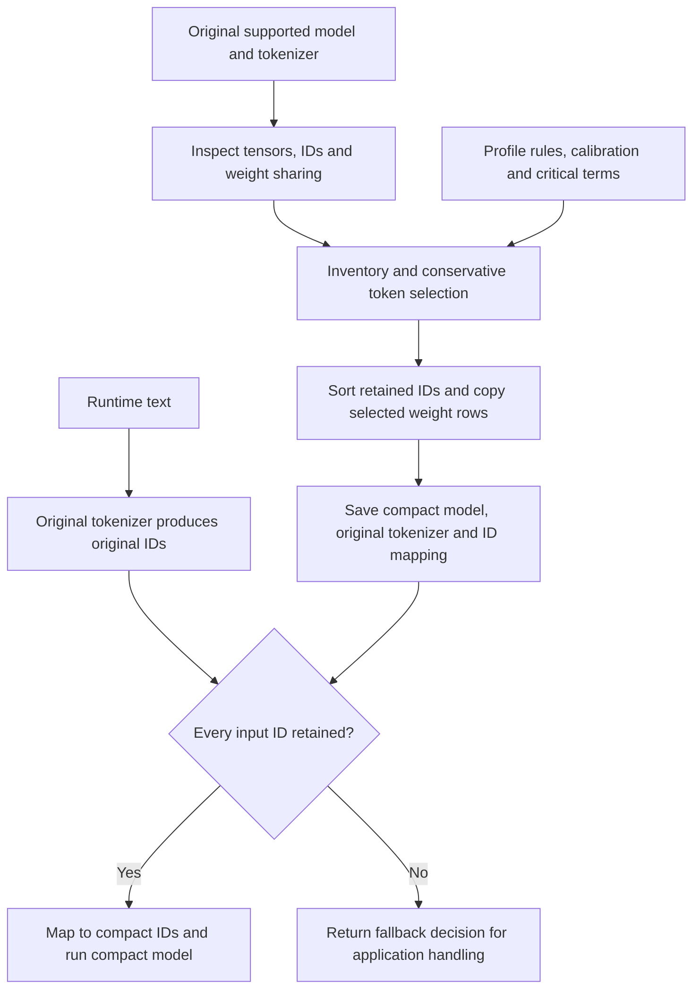

# VocabCraft

Safe, profile-aware vocabulary compaction for multilingual models.

VocabCraft reduces the vocabulary-dependent part of a pretrained model by
retaining selected embedding/output rows and assigning them contiguous IDs.
The transformer layers and the original tokenizer are preserved. Compaction
uses deterministic rules and calibration examples; it does not train a new
tokenizer, fine-tune the model, distill it, or quantize its weights.

Adapters support mT5 (`google/mt5-small`) and encoder-only XLM-RoBERTa, including
the supplied STE SentenceTransformers checkpoint (`24_lang_base_model`).
XLM-R supports `encoder_exact` and masked-mean sentence embeddings; the two
generation modes remain mT5-only. The example profiles target English, Hindi, Latin/Devanagari text,
code switching, romanized Hindi, names, URLs, email, numbers, symbols, emoji,
and noisy input. These are retention goals, not a guarantee of complete
coverage of those inputs.

`encoder_exact` is the best-tested path. Both generation modes are experimental.
The [review fixes](#review-fixes-and-remaining-boundaries) below describe enforced
validation gates and the remaining deployment boundaries. Smoke equivalence is
not a substitute for task-quality evaluation.

## How it works

There are two phases: build a compact artifact offline, then guard each request
before using it.



### 1. Inspect the actual model

Architecture dispatch reads `config.model_type`; `MT5Adapter.inspect_model()`
and `XLMRobertaAdapter.inspect_model()` record tokenizer and model vocabulary sizes,
embedding dimensions, special IDs, generation settings, dependency versions,
model-state/tokenizer hashes, and tensors with a vocabulary-sized dimension.
`detect_weight_tying()` checks tensor storage pointers as well as configuration:
shared input embeddings and an output projection can have different sharing
relationships even when `tie_word_embeddings` is set.

This matters for both correctness and memory accounting. Copying a shared
matrix multiple times wastes space; accidentally tying distinct input/output
weights changes model behavior. The adapter validates supported mT5 structures
and rejects tensor shapes it cannot compact safely. For XLM-R, only
`embeddings.word_embeddings.weight` is pruned. Position and token-type embeddings,
transformer blocks, and any dense pooler stay unchanged. Explicit tensor names
prevent a coincidentally vocabulary-sized hidden or position dimension from
being mistaken for a vocabulary axis.

### 2. Build an inventory and select a retained set

`build_inventory()` creates a record for each original tokenizer ID. It records
the piece, special/control/unknown/byte flags where available, Unicode scripts
and categories, emoji presence, occurrence counts, selection reasons, and a
storage tier. The SentencePiece whitespace marker `▁` is removed only while
analyzing characters; the stored piece and actual tokenization are unchanged.

`observe_calibration()` streams JSONL source and optional target texts through
the original tokenizer. `observe_critical_terms()` also tokenizes each critical
term. `select_profile()` then takes a conservative union of:

- Mandatory tokenizer/model/generation IDs, including special tokens and
  supported forced/suppressed-token settings.
- All tokens observed in calibration sources and targets, plus critical terms.
- Pieces compatible with the configured Unicode scripts and enabled shared
  characters, number, punctuation, symbol, emoji, and URL/email rules.
- Explicitly kept IDs and pieces.

Frequency counts are recorded for inspection; there is no frequency cutoff,
top-k vocabulary budget, learned importance score, or automatic language
classifier. With Latin and Devanagari enabled, all compatible pieces are kept,
including unobserved ones. This favors coverage and can retain a large fraction
of the original vocabulary.

Manual removals are applied after the union. Mandatory IDs and critical tokens
cannot be removed. With `strict: true`, observed source/target IDs are also
protected. Every retained token keeps its reasons; unselected tokens are marked
`cold_fallback`, not certified unreachable. The other tier labels are
`mandatory_core`, `shared_core`, `language_profile`, and `domain_profile`;
these are manifest categories, not separate runtime memory pools.

### 3. Remap IDs and gather exact rows

`IdMapping.from_retained()` sorts original IDs and assigns compact IDs from zero.
For an illustrative retained set `[0, 1, 2, 10, 42]`:

| Original ID | Compact ID |
| --- | --- |
| 0 | 0 |
| 1 | 1 |
| 2 | 2 |
| 10 | 3 |
| 42 | 4 |

Original input `[42, 10, 1]` becomes `[4, 3, 1]`. Input `[42, 99, 1]` cannot be
mapped because row 99 is absent. Generated compact IDs are mapped back to
original IDs before decoding with the original tokenizer. Training labels use
the same mapping while preserving PyTorch's ignore value `-100`.

If `R` is the ordered retained set and `E` is the original embedding matrix,
the row-copy method is:

```text
compact_E[j] = original_E[R[j]]
compact_E[old_to_new[i]] = original_E[i]   for every retained original ID i
```

The adapter uses PyTorch `index_select(0, retained_ids)` for vocabulary rows and
copies the remaining tensors. Supported special and generation ID fields are
remapped in copied configurations. Safetensors checkpoints are saved and
reloaded, and retained embedding rows are checked with `torch.equal`.
The XLM-R builder also checks every reloaded non-vocabulary tensor exactly and
preserves checkpoint dtype. Its padding ID must keep its numeric index: XLM-R
derives position IDs from that index, so remapping it would change hidden states.

For a single matrix with `V` rows, width `d`, and `b` bytes per element, storage
is `V * d * b`. Retaining `K` rows saves `(V - K) * d * b` bytes for that matrix.
Sharing, output heads, other weights, tokenizer files, and fallback storage must
be accounted for separately when estimating total savings.

### 4. Choose the model mode

| Mode | Model changes | Behavior and limits |
| --- | --- | --- |
| `encoder_exact` | Compact encoder embeddings; preserve encoder transformer weights. Export an encoder-only model. | Covered inputs use the same embedding values, token sequence length, and attention mask. Measure numerical equivalence in evaluation mode. It does not generate text. |
| `seq2seq_compact` | Compact encoder/decoder input embeddings and output projection; preserve remaining encoder/decoder weights. | Smaller output vocabulary can change probabilities and generated text. Input coverage does not guarantee output equivalence. |
| `seq2seq_guarded` | Compact input embeddings while keeping the full original output projection. | Transformers greedy generation with original-ID logits processors and a guarded decoder-embedding lookup. Requires a supported untied output head and a consistent tying configuration. |

For `encoder_exact`, unchanged inputs and transformer weights explain why
covered encoder states should agree, subject to numerical precision and runtime
behavior. Compare against the original **encoder**, not the size of the full
encoder-decoder model, when reporting encoder compaction savings.

For compact seq2seq, even identical retained raw logits have a different softmax
denominator after output rows are removed:

```text
original_p(i) = exp(logit_i) / sum(exp(logit_j) for j in original vocabulary)
compact_p(i)  = exp(logit_i) / sum(exp(logit_j) for j in retained vocabulary)
```

Changing the denominator alone does not change the ordering of retained logits.
Greedy decoding can still diverge when the original winning token was removed;
sampling probabilities, beam scores, and losses can change as well.

`GuardedMT5Generator.generate_greedy()` uses the public Transformers `generate()`
pipeline with full-vocabulary logits and original-ID forced tokens, suppression,
repetition constraints, and stopping settings. A decoder embedding pre-hook
guards/maps IDs only at lookup time. If a required row is missing, it restarts
the whole request on a supplied full model with the same generation settings;
without a handler it returns an unsupported result. Calls through the wrappers
are serialized per compact model and hooks are removed even on failure. Do not
call that model directly during a guarded request. Only deterministic greedy
decoding with a positive output limit is supported; sampling, beams, wall-clock
stopping, and other unsupported generation settings are rejected explicitly.

## Safety model

The conservative path keeps the original tokenizer unchanged, including
backend-only Unigram tokenizers saved as `tokenizer.json`. It
first obtains the original token IDs, checks that every ID has a retained row,
and only then maps the sequence to contiguous compact IDs. A missing ID is never
silently replaced by UNK, PAD, zero, a similar token, or an estimated embedding.
It returns an explicit missing-ID decision for fallback/rejection handling;
directly mapping an unsupported sequence raises an error.

`ProfiledTokenizer` provides `encode()`, `batch_encode()`, `guard_batch()`, and
`decode()`. A `GuardDecision` contains original IDs, compact IDs when supported,
missing IDs/pieces, the profile ID, and the requested fallback policy.
`batch_encode()` preserves the original tokenizer's padding and attention masks
and returns a separate decision for each row.

The original tokenizer can itself produce UNK; compaction does not repair that
pre-existing limitation. Missing compact rows are a different condition and are
never converted into UNK.

The `full_model` policy is a requested action, not automatic model loading.
`CompactMT5Encoder.encode()` and `CompactXLMRobertaEncoder.encode()` return
`(None, decision_dict)` for unsupported
inputs, and `CompactMT5Seq2Seq.generate_greedy()` returns `generated: false`.
Applications must inspect these results and dispatch or reject the request.
`FallbackExecutor.execute()` can call a caller-supplied full-model function or
callback, or raise on rejection. An unavailable handler fails closed. The
guarded generator has its own full-model restart path, but no callback handler.

See [safety-model.md](docs/safety-model.md) and
[limitations.md](docs/limitations.md) before deployment.

## Installation

Python 3.11 or newer is required. The CLI, wrappers, and benchmarks execute on
CPU; unsupported devices and precision-conversion requests fail explicitly.
`runtime.dtype: auto` uses the adapter's loading policy (XLM-R preserves the
source dtype); `float32`/`fp32` additionally requires loaded FP32 weights.
Compaction does not cast or quantize them. `runtime.batch_size` controls padded
encoder-validation batches. `fail_closed_when_unavailable: false` is rejected;
`record_missing_pieces: false` suppresses piece text in configured guard reports.

```powershell
python -m pip install -e ".[dev]"
vocabcraft --help
vocabcraft check-config --profile configs/profiles/en-hi.yaml
```

Model downloads are initiated only by model-dependent commands. Remote code is
disabled by default.

## Configure a profile

Start with [configs/profiles/en-hi.yaml](configs/profiles/en-hi.yaml).
Calibration and critical-term paths are resolved relative to the YAML file.
Calibration records use `id` and either `text` or `source`; `target` is optional:

```jsonl
{"id":"chat-1","text":"Ravi का फोन","language":"hi","domain":"chat"}
{"id":"translate-1","source":"Open the phone","target":"फोन खोलें","source_language":"en","target_language":"hi","critical":true}
```

`critical: true` protects the record's observed tokens during selection and
allows missing critical evaluation examples to fail validation. Critical-term
files contain one term per line; blank lines and lines starting with `#` are
ignored. Keep a separate evaluation corpus to test inputs beyond calibration.

Profile flags are additive retention rules, not a strict allow/deny policy:
turning one off can leave the same tokens retained by another rule. In the
current selector, ASCII/native digit flags share a number rule, URL/email flags
share a rule, and Common/Inherited flags share a rule. Code-switching and
romanized-Hindi flags add annotations to pieces already kept by allowed scripts.
`profile.languages` records intent; `unicode_scripts` and observed pieces drive
selection. Disabling a special-token flag cannot remove a mandatory ID.

Set `model.revision` to an exact source revision for reproducible analysis,
builds, and validation. `inspect-model` has a separate `--revision` option.
`benchmark` and `build-pack` reuse the compact artifact's saved source revision.
Source-model and tokenizer-hash mismatches abort those workflows.

## mT5-small walkthrough

Run these commands from the repository root. Each output directory must be new;
use a different directory name when repeating a command.

```powershell
vocabcraft inspect-model --model google/mt5-small --output artifacts/inspection

vocabcraft analyze-vocab `
  --model google/mt5-small `
  --profile configs/profiles/en-hi.yaml `
  --output artifacts/en-hi-analysis

vocabcraft build-profile `
  --model google/mt5-small `
  --profile configs/profiles/en-hi.yaml `
  --mode encoder_exact `
  --output artifacts/mt5-small-en-hi-encoder

vocabcraft validate `
  --original google/mt5-small `
  --compact artifacts/mt5-small-en-hi-encoder `
  --profile configs/profiles/en-hi.yaml `
  --data examples/smoke-en-hi.jsonl `
  --output artifacts/validation

vocabcraft benchmark `
  --original google/mt5-small `
  --compact artifacts/mt5-small-en-hi-encoder `
  --data examples/smoke-en-hi.jsonl `
  --output artifacts/benchmark

vocabcraft build-pack `
  --model google/mt5-small `
  --compact artifacts/mt5-small-en-hi-encoder `
  --output artifacts/cold-pack

vocabcraft reconstruct-full `
  --compact artifacts/mt5-small-en-hi-encoder `
  --pack artifacts/cold-pack `
  --output artifacts/reconstructed-encoder
```

The intentionally Japanese smoke example is not calibration data. It is used to
verify that an unsupported-script token triggers explicit fallback.

To study compact generation separately:

```powershell
vocabcraft build-profile `
  --model google/mt5-small `
  --profile configs/profiles/en-hi.yaml `
  --mode seq2seq_compact `
  --output artifacts/mt5-small-en-hi-seq2seq
```

Do not interpret a successful compact-generation run as a zero-risk or formal
equivalence result.

## Use a built artifact from Python

The encoder wrapper exposes hidden states and the guard result:

```python
from vocabcraft.exceptions import MissingTokenError
from vocabcraft.models.mt5_encoder import CompactMT5Encoder

encoder = CompactMT5Encoder.from_artifact(
    "artifacts/mt5-small-en-hi-encoder", fallback_policy="reject"
)
output, decision = encoder.encode("Ravi का फोन")
if output is None:
    # This example rejects; an application can instead dispatch to its full model.
    raise MissingTokenError(decision["missing_original_ids"])

print(output.last_hidden_state.shape)  # [1, sequence_length, embedding_dimension]
```

For experimental text generation, load `CompactMT5Seq2Seq.from_artifact()` from
`vocabcraft.models.mt5_seq2seq` and call
`generate_greedy(text, maximum_output_length=32)`. Check `generated` before
reading `text`. A successful result includes both compact and original output
IDs. Always use these wrappers or the mapping/guard APIs: the saved tokenizer
still emits original IDs and cannot be passed directly to the compact model.

## STE / XLM-R sentence-embedding walkthrough

The supplied local `24_lang_base_model` is a 12-layer XLM-R encoder with a
250,002-row, 384-dimensional word matrix. Its saved SentenceTransformers
pipeline is **Transformer + mean Pooling**, not the dense XLM-R pooler output.
No training or SentenceTransformers dependency is needed to prune it.

Use the complete local checkpoint directory so its pooling, prompts, maximum
sequence length, and lowercasing settings can be read. Hub identifiers support
bare XLM-R encoders, but remote SentenceTransformers pipeline discovery is not
implemented. Other pooling modes, extra modules, MLM heads, and dimension
truncation are rejected rather than silently discarded.

```powershell
$steModel = 'C:\Users\anupk\Downloads\ste\STE\24_lang_base_model'
vocabcraft inspect-model --model $steModel --output artifacts/ste-inspection
vocabcraft build-profile --model $steModel --profile configs/profiles/ste-en-hi.yaml --mode encoder_exact --output artifacts/ste-en-hi
vocabcraft validate --original $steModel --compact artifacts/ste-en-hi --profile configs/profiles/ste-en-hi.yaml --data examples/smoke-en-hi.jsonl --output artifacts/ste-validation
vocabcraft benchmark --original $steModel --compact artifacts/ste-en-hi --data examples/smoke-en-hi.jsonl --output artifacts/ste-benchmark
vocabcraft build-pack --model $steModel --compact artifacts/ste-en-hi --output artifacts/ste-cold-pack
vocabcraft reconstruct-full --compact artifacts/ste-en-hi --pack artifacts/ste-cold-pack --output artifacts/ste-reconstructed
```

The example profile reuses English/Hindi calibration. The checkpoint folder name
does not specify the desired 24-language retention policy; customize scripts,
calibration, and critical terms before building a wider deployment profile.
The source checkpoint, optimizer, and training files are never modified.

```python
from vocabcraft.models.xlm_roberta import CompactXLMRobertaEncoder

encoder = CompactXLMRobertaEncoder.from_artifact("artifacts/ste-en-hi")
vector, decision = encoder.embed("Ravi का फोन", normalize_embeddings=True)
if vector is None:
    # Supply your original full-model service here, or reject the request.
    raise RuntimeError(f"Full model required: {decision['missing_original_ids']}")
print(vector.shape)  # torch.Size([384])

vectors, decisions = encoder.embed_batch(["Open the phone", "東京へ行きます"])
# Input order is preserved; an uncovered row is None with a fallback decision.
```

`encode()` returns token-level hidden states; `embed()`/`embed_batch()` return
sentence vectors. The saved prompt (or explicit `prompt`/`prompt_name`),
lowercasing, and truncation are applied before guarding the tokens actually
consumed by the model. This checkpoint truncates to 512 tokens and has empty
query/document prompts. Calibration selection remains conservative and
untruncated. Dynamic batch padding preserves the original attention mask.

For token states `h[t]` and attention mask `m[t]`, the sentence method is:

```text
sentence = sum(h[t] * m[t]) / max(sum(m[t]), epsilon)
normalized_sentence = sentence / max(L2_norm(sentence), epsilon)  # optional
```

Padding is excluded; attended special tokens and prompt tokens are included,
matching this saved pooling configuration. Always use the VocabCraft wrapper:
loading the compact directory directly as a `SentenceTransformer` would omit
the required original-to-compact ID guard and mapping.

## Validation and benchmarking methods

| Method | What the implementation measures |
| --- | --- |
| Coverage | Source/target token coverage, fully covered records, missing IDs/pieces, affected critical examples, and fallback-required records. If a target exists, it also affects record coverage. |
| Encoder equivalence | Embeddings, intermediate states, and final hidden states with identical attention masks in `eval()`/`no_grad()` mode. Padding is excluded from comparisons. Gates use per-example final-state maximum/mean absolute error and both token and sequence cosine similarity. Saved sentence pipelines also gate masked-mean and normalized vectors. |
| Teacher forcing | Feed known source and target IDs to both models, select the original logits for retained rows, and compare them with compact logits. Report both losses; unequal softmax denominators make equal losses unnecessary. |
| Greedy comparison | Generate with `do_sample=False`, `num_beams=1`; map compact outputs back and compare original IDs, decoded text, first divergence, lengths, and EOS presence. CLI validation uses 32 new tokens. |
| External task evaluation | Run a configured local command for each model using `{model_path}`. Prefer `{metrics_file}` for a unique output file per run; legacy fixed paths must show a fresh file update. Validate finite metric values and paired score lists. The command must understand a compact artifact's tokenizer and mapping. |
| Paired bootstrap | Resample paired per-example score differences (`compact - original`) 10,000 times with seed 2026. The lower endpoint of a 95% percentile interval must be at least the negative allowed drop. Scores must be aligned and higher-is-better. Aggregate thresholds alone are also supported, but do not establish statistical non-inferiority. |
| CPU benchmark | Time encoder forward passes on the first fully covered source example, with 2 warmups and 10 measured iterations. Separately time tokenization and ID mapping; mapping repeats across all covered source rows 100 times. |

Read the JSON reports for per-example details; the Markdown reports contain
scalar summaries. Coverage reports count requests needing fallback, not completed
full-model fallback executions. Missing-token counts include repeated occurrences
and distinguish source/target languages. `new_unk_count` compares original UNKs
with the original-to-compact-to-original mapped IDs on covered sequences; it
does not measure a downstream model's generated output or fallback execution.

`validate` exits with code 3 when `passed` is false. It requires nonempty data
and at least one mode-appropriate comparison; fully uncovered data cannot pass.
Critical coverage, new-UNK accounting, encoder and teacher-forcing failures,
and optional external metrics are enforced. Compact generation exact-ID/text
matching is enforced when `generation_exact_match_required: true`; guarded
generation always requires successful original-ID matching, including full-model
restarts. `comparison_counts` distinguishes evaluated paths. A passing report
can still contain fallback-required examples: inspect the coverage and fallback
rate before choosing a deployment policy.

Benchmarking runs the encoder even for seq2seq artifacts; it does not measure
decoder throughput or fallback service latency. Theoretical FP16/BF16 sizes are
calculations, not exported lower-precision checkpoints. Reported peak process
RSS includes concurrently loaded models and is not an isolated deployment
memory measurement. Energy is not measured.

## Cold packs and reconstruction

`build-pack` exports every excluded **model** row into `rows.safetensors`,
including model-only padding rows with no tokenizer ID. It records original IDs,
source-model/tokenizer hashes, tensor names/shapes/dtypes, and SHA-256 file and
tensor checksums. Packs preserve vocabulary rows; they do not contain a separate
complete model.

`merge-packs` accepts repeated `--pack` arguments. It verifies compatibility,
sorts rows by original ID, accepts identical duplicates, and rejects conflicting
rows. `reconstruct-full` uses `index_copy_` to place retained and cold rows back
at their original positions. Retained and cold IDs must be disjoint and cover
every original model row. It saves and reloads the result and compares all
restored state tensors exactly.

Reconstruction is offline. An encoder artifact plus its pack restores the full
vocabulary **encoder**, not the omitted decoder. Runtime pack swapping or NPU
loading is not implemented. Reconstruction restores original generation token
settings and preserves supported tied, untied, and mixed mT5 storage structures.
Offline tests exercise all three modes; real STE tests compare every restored
state tensor, not only the word matrix.

## Recorded STE smoke results

September 10, 2026: real local checkpoint, `ste-en-hi-v1` profile, FP32,
Transformers 5.16.1 and PyTorch 2.13.0+cpu. Generated files are under ignored
`artifacts/ste-20260910-*`; weights are not committed to Git.

| Measurement | Result |
| --- | --- |
| Original / retained / excluded word rows | 250,002 / 123,304 / 126,698 |
| Word-embedding dimensions | 384, unchanged |
| Original / compact word parameters | 96,000,768 / 47,348,736; 50.68% fewer |
| Original / compact total parameters | 117,640,704 / 68,988,672 |
| Non-vocabulary parameters | 21,639,936, unchanged |
| Serialized original / compact model bytes | 470,585,941 / 275,977,813; 41.35% smaller |
| Entire compact artifact, including tokenizer/manifests | 303,931,538 bytes |
| Covered / fallback-required smoke records | 13 / 1 of 14 |
| Covered hidden, mean-pooled, normalized comparisons | All 13 passed; maximum absolute difference 0.0 in each category |
| Reload and cold-pack reconstruction | All expected tensors exactly equal; restored 250,002 rows |
| Short CPU encoder benchmark, original / compact mean | 19.24 / 20.20 ms; no speedup demonstrated |

This is a storage reduction, not transformer-layer pruning. The small latency
sample includes normal runtime variation and is not evidence of acceleration.
No product-quality or complete 24-language claim follows from these smoke tests.

## Recorded mT5-small smoke results

The following values were rechecked against locally saved reports from the
September 2, 2026 run; this README review did not rerun the full real-model build.
That run used revision `73fb5dbe4756edadc8fbe8c769b0a109493acf7a`,
Transformers 5.16.1, PyTorch 2.13.0+cpu, SentencePiece 0.2.1, and FP32 weights.
Reports and checkpoints live under ignored `artifacts/` and are not included in
a fresh clone. Results can differ with the source revision, dependency versions,
profile, or corpus.

| Measurement | Recorded result |
| --- | --- |
| Original tokenizer IDs / model rows | 250,100 / 250,112 |
| Retained rows / excluded model rows | 140,792 / 109,320; 56.29% retained |
| Embedding width | 512 |
| Original encoder / compact encoder parameters | 146,940,608 / 90,968,768 |
| Original encoder / compact encoder serialized model bytes | 587,772,050 / 363,884,690; approximately 38.1% smaller |
| Covered smoke records / fallback-required records | 13 / 1 out of 14 |
| Covered encoder comparisons | 13; final hidden-state maximum and mean absolute differences were 0.0 |
| Compact seq2seq greedy comparisons | 13 exact original-ID matches |
| Teacher-forced comparisons | 2 passed; largest retained-logit absolute difference was approximately 2.29e-5 |
| Encoder reconstruction | Completed at 250,112 rows; real integration also checks exact reconstructed encoder tensors |

The Japanese example exercises the missing-ID decision. These small smoke cases
do not establish task accuracy or complete English/Hindi coverage. The original
checkpoint had shared encoder/decoder input storage and a distinct output head
despite `tie_word_embeddings: true`; guarded mode rejects that inconsistent
contract explicitly.

## Output artifacts

- `inspection.json` / `inspection.md`: actual model, tokenizer, tensor, special
  ID, hash, parameter, and storage-tie inspection.
- `token-manifest.jsonl.gz`: typed record and selection reasons for every
  tokenizer ID.
- `retained-ids.json`, `excluded-ids.json`, `mapping-report.json`: profile
  membership and bijective ID maps.
- `model/`: safetensors compact checkpoint; `tokenizer/` is an unchanged copy of
  the original tokenizer artifacts.
- `vocabcraft-metadata.json`, `source-config.json`,
  `source-generation-config.json`: source hashes, sizes, mode, and source
  configurations. Original generation settings are restored by reconstruction.
- `sentence-embedding-config.json`: XLM-R sentence preprocessing/pooling settings
  (or null for a bare encoder), checked against the saved configuration hash.
- `validation.json` / `validation.md`: coverage, per-example equivalence,
  teacher-forced, generation, and strict-failure results.
- `benchmark.json` / `benchmark.md`: separately labeled theoretical bytes,
  serialized size, process memory, mapping overhead, and runtime latency.
- `risk-report.json` / `risk-report.md`: guarantees, empirical evidence, and
  unresolved risks.
- `reproducibility-manifest.json`: dependency versions and workflow-specific
  hashes in analysis/validation outputs. Analysis records the profile hash;
  validation also records its evaluation-data hash. Calibration and critical-term
  file contents are not separately hashed in these manifests.
- cold packs: `rows.safetensors`, original IDs, manifest, and checksums.

Artifact directories are staged beside their destination and published only
after successful completion. Existing directories are not overwritten.

## Tests and quality checks

Offline checks do not download a model:

```powershell
ruff check .
mypy src/vocabcraft
pytest tests/unit
```

Real-model integration is explicitly gated:

```powershell
$env:RUN_MT5_INTEGRATION = "1"
pytest tests/integration -k mt5

$env:RUN_STE_INTEGRATION = "1"
$env:STE_MODEL_PATH = 'C:\Users\anupk\Downloads\ste\STE\24_lang_base_model'
pytest tests/integration/test_ste_embedding_compaction.py
# Optional: reuse an existing matching artifact to avoid rebuilding:
# $env:STE_ARTIFACT_PATH = 'artifacts/ste-20260910-en-hi'
```

Integration exercises real tokenizer metadata, inspection, selection, encoder
row copying/equivalence/fallback, experimental seq2seq logits/generation, cold
packs, and exact reconstruction.

The September 10 update adds offline regression coverage for failed validation
gates, stale metrics, corrupt mappings, guarded generation constraints, padding,
pooling, dtype preservation, tensor-dimension collisions, and reconstruction.
All 159 offline unit tests, Ruff, and mypy passed. All four real STE integration
tests passed, plus the actual CLI build, validation,
benchmark, and reconstruction workflows. The older real mT5 suite could not be
rerun offline because its full source checkpoint was no longer in the local
Hugging Face cache; its historical results above are labeled separately.

## Methods and source map

| Responsibility | Main implementation |
| --- | --- |
| CLI and workflow orchestration | [cli.py](src/vocabcraft/cli.py), [workflows.py](src/vocabcraft/workflows.py) |
| Unicode/SentencePiece inventory | [inventory.py](src/vocabcraft/inventory.py), [unicode_analysis.py](src/vocabcraft/unicode_analysis.py), [sentencepiece.py](src/vocabcraft/tokenizers/sentencepiece.py) |
| Calibration and retained-set selection | [selection.py](src/vocabcraft/selection.py): `observe_calibration`, `observe_critical_terms`, `select_profile` |
| ID bijection and guard/fallback | [mappings.py](src/vocabcraft/mappings.py): `IdMapping`; [fallback.py](src/vocabcraft/fallback.py): `ProfiledTokenizer`, `FallbackExecutor` |
| Architecture dispatch and row-copy builders | [registry.py](src/vocabcraft/models/registry.py), [mt5.py](src/vocabcraft/models/mt5.py), [xlm_roberta.py](src/vocabcraft/models/xlm_roberta.py) |
| Sentence vectors and preprocessing | [xlm_roberta.py](src/vocabcraft/models/xlm_roberta.py): `CompactXLMRobertaEncoder`, `pool_sentence_embeddings`, `tokenize_embedding_text` |
| Runtime loaders and generation | [mt5_encoder.py](src/vocabcraft/models/mt5_encoder.py), [mt5_seq2seq.py](src/vocabcraft/models/mt5_seq2seq.py), [mt5_guarded_generation.py](src/vocabcraft/models/mt5_guarded_generation.py) |
| Numerical and task evaluation | [evaluation/](src/vocabcraft/evaluation/), especially `compare_encoder_models`, `compare_teacher_forcing`, `compare_greedy_generation`, `paired_bootstrap_non_inferiority` |
| Packs, artifact publishing, and reports | [packs.py](src/vocabcraft/packs.py), [artifacts.py](src/vocabcraft/artifacts.py), [reporting.py](src/vocabcraft/reporting.py), [benchmarking.py](src/vocabcraft/benchmarking.py) |

## Review fixes and remaining boundaries

The September 10 review fixes the previously documented failures:

| Issue | Implemented fix |
| --- | --- |
| Ignored validation outcomes / zero comparisons | Mode-aware gates now enforce configured checks and require actual evidence. |
| Raw-argmax guarded generation | Original-ID Transformers generation processors, guarded decoder lookup, and identical-settings full restart. |
| Inactive runtime settings | CPU and precision constraints are explicit; encoder validation batches; missing-piece reporting honors its flag. |
| Stale external metrics | Unique per-run output placeholder or freshness verification; nonfinite/misaligned scores rejected. |
| Weak tokenizer/config provenance | New artifacts fingerprint tokenizer behavior and XLM-R sentence settings; encoder loaders verify them. |
| Incorrect occurrence and UNK accounting | Repeated missing IDs and target languages counted; compact-path UNKs measured after mapping roundtrip. |
| Reconstruction edge cases | Empty packs, corrupt ID order/types, original generation settings, and supported mixed tying covered. |
| Wrong encoder dispatch / vocabulary-axis inference | Encoder-only XLM-R keeps its embedding/position pipeline; adapters declare exact vocabulary tensor names. |

Legacy artifacts lacking fingerprints retain weaker provenance checks; rebuild
them for the new checks. Backend-only tokenizers can still have incomplete
per-piece SentencePiece type annotations. Script rules remain heuristic and
additive; production use needs representative task evaluation and an explicit
fallback service. These fixes do not establish universal generation equivalence.

## Extending VocabCraft

Generic inventory, Unicode analysis, mapping, guarding, packs, and evaluation
do not contain mT5-specific tensor logic. Add another adapter behind the
`ModelAdapter` contract, validate every vocabulary-sized tensor and special ID,
and add gated real-checkpoint tests. See
[model-adapter-contract.md](docs/model-adapter-contract.md).

## Current limitations

- Finite English-Hindi calibration is not proof of complete language coverage.
- Script compatibility is a conservative inclusion heuristic, not formal
  tokenizer reachability.
- Product deployment still requires hidden task evaluation.
- The final product-wide 24-language list has not been supplied; the example
  profile intentionally keeps that list empty.
- Dynamic live NPU pack loading and pruning-plus-quantization are not included.
- Guarded generation supports only deterministic greedy decoding with an
  explicit output limit; sampling and beam search are rejected.
